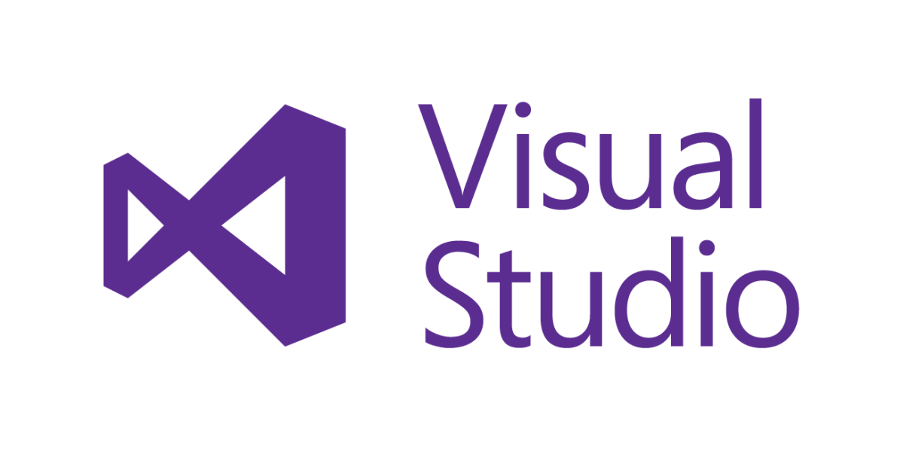
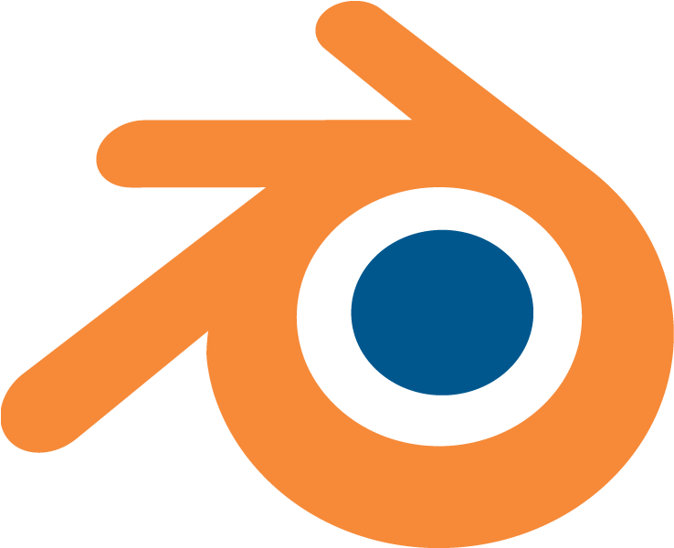
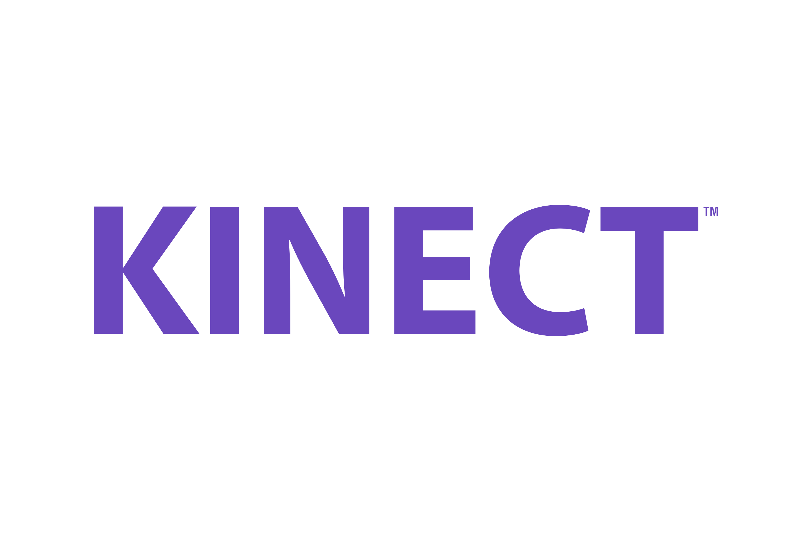

<h1>Szatyor</h1>

<h2>🛍 A projekt</h2>

Projektünk egy Kinect segítségével irányítható 3D-s játék, melyben akadályokat kell kikerülni.

<h2>⚙ Technológiák</h2>
<ul>
  <li>C#</li>
  <li>Unity</li>
</ul>

<h2>🖥 Rendszerkövetelmények</h2>
<ul>
  <li>CPU: 64 bites, 2-magos</li>
  <li>RAM: 4 GB</li>
  <li>Videókártya: ami támogatja a DirectX 11-et</li>
  <li>Operációs rendszer: Windows 8, 8.1 vagy 10</li>
</ul>

<h2>📖 A játék története</h2>

<h2>🕹 A játék menete</h2>

A játék során egy csontváz karakter elől kell elfutni, miközben különféle akadályokat kell leküzdeni. A játék addig megy, amíg el nem rontunk egy akadályt, tehát nem lehet kivinni egy pályát, hiszen a végtelenségig megy.

<h2>📓 Dokumentáció</h2>
<h3>Funkcionális követelmények</h3>
<ul> 
  <li>A programnak meg kell jelenítenie az adott pillanatig megtett távot méterben.</li>
  <li>A programnak meg kell jelenítenie az fps-t (frame/second).</li>
  <li>A program képes legyen a játékos mozgásait felismerni, ezzel irányítva a játékot.</li>
  <li>A programba lehessen játékos nevet beírni. </li>
  <li>A programnak tudnia kell eltárolni az adott játékos általt elért eredményt.</li>
  <li>A programból ki tudjon lépni a játékos.</li>
  <li>A program jelezze ki a Kinect csatlakozásának állapotát.</li>
  <li>A programot lehessen elindítani illetve megállítani játék közbe.</li>
</ul>
<h3>Nem funkcionális követelmények</h3>
<ul>     
  <li>A programot legalább Windows 8-on kell futattni.</li>
  <li>A játéknak képesnek kell lenni futnia legalább 4 GB memóriával</li>
  <li>A maximum fps-nek 60-nak kell lennie.</li>
  <li>A felhasználói felület könnyen látható legyen.</li>
  <li>Egy adott kézmodulatra a program megfelelő funkciója csak egyszer hajtódjon végre.</li>
  <li>A játékhoz írt kódnak karbantarthatónak kell lennie.</li>
</ul>

<h2>🛠 Használt eszközök</h2>

| Mire  | Mit | Link |
| :-: | :-: | :-: |
| Kódolás |  | <a href="https://visualstudio.microsoft.com/vs/community/">Visual Studio Community</a> | 
| Modellezés |  | <a href="https://www.blender.org/">Blender</a> | 
| Játék készítése |  | <a href="https://unity.com/">Unity</a> | 
| Tesztelés |  | <a href="https://www.microsoft.com/en-us/download/details.aspx?id=44561">Kinect SDK</a> | 

